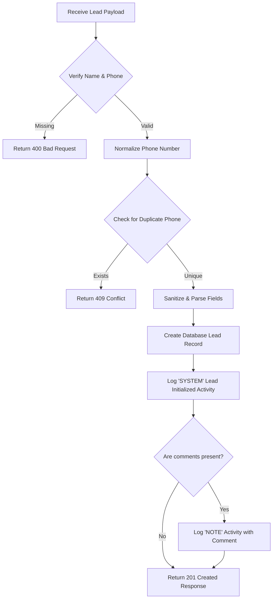

# CRM Lead Flow & Lifecycle Analysis

This document describes the flow of a lead in the CRM-Cookscape application, including creation steps, updates, assignment, activity tracking, and related entities.

---

## 1. Lead Schema & Relations

A `Lead` is the central model of the CRM system, defined in [schema.prisma](file:///c:/Users/Aravind-Techie/Desktop/Applications/CRM-Cookscape/apps/api/prisma/schema.prisma#L37-L71). It has the following relationships:

* **Ownership & Assignment**:
  * `createdBy`: The `User` who inputted the lead.
  * `assignedTo`: The `User` (e.g., CRE, Designer) responsible for following up.
* **Classification**:
  * `status`: Current state (e.g., New, Follow-up, Closed) mapped to `LeadStatus`.
  * `currentStage`: CRM pipeline stage (e.g., Feasibility, Design) mapped to `Stage`.
  * `source`: Where the lead came from (e.g., Website, Facebook, Direct) mapped to `Source`.
  * `brand` / `project`: The associated brand and property project.
  * `tags`: Custom labels mapped to `LeadTag[]`.
* **Engagement & Tracking**:
  * `activities`: A log of every action or update (`LeadActivity[]`).
  * `tasks`: Reminders and action items (`Task[]`).
  * `appointments`: Scheduled face-to-face or virtual meetings (`Appointment[]`).
  * `showroomVisits`: Logged customer visits to physical showrooms (`ShowroomVisit[]`).

---

## 2. Lead Creation Flow

Implemented in [leads.controller.ts:createLead](file:///c:/Users/Aravind-Techie/Desktop/Applications/CRM-Cookscape/apps/api/src/controllers/leads.controller.ts#L187-L278):

### Key Creation Steps:
1. **Validation**: Enforces presence of `name` and `phone`.
2. **Phone Normalization**: Removes non-digit characters and extracts the last 10 digits to match the standard format.
3. **De-duplication**: Searches the database for existing active records matching the phone number to prevent duplicate entries.
4. **Data Sanitization**:
   - Converts dates (`nextFollowUp`, `dataCollected`, `contactableDate`) from ISO strings.
   - Defaults creator to the first active Admin (or `system`) if `createdById` is not provided.
5. **Entity Connection**: Connects the lead to tags, brands, projects, sources, and statuses.
6. **Activity Bootstrapping**:
   - Creates a **SYSTEM** activity: `"Lead initialized via [Source Name]"`.
   - Creates a **NOTE** activity if initial comments were submitted.

---

## 3. Lead Actions & Updates Flow

Once created, leads undergo various transitions handled by [leads.controller.ts](file:///c:/Users/Aravind-Techie/Desktop/Applications/CRM-Cookscape/apps/api/src/controllers/leads.controller.ts):

### A. Updating Details (`updateLead`)
- Modifies general attributes like rating, email, brand, etc.
- **De-duplication**: Runs a check to ensure phone updates don't clash with other leads.
- **Comments History Preservation**: If the new comments do not include the old comments, it appends them: `[old comment] / [new comment]` and logs a `NOTE` activity containing only the newly added portion.
- **Activity Logging**:
  - If `statusId` is changed, logs a **STATUS_CHANGE** activity: `"Status transitioned to [Status Name]"`.
  - Otherwise, logs a **SYSTEM** activity: `"Lead details refined"`.

### B. Assignment (`assignLead` & `bulkAssignLeads`)
- Links/unlinks the lead to an agent (`assignedToId`).
- Logs an **ASSIGNMENT** activity: `"Assigned to user ID: [user_id]"` or `"Lead unassigned"`.

### C. Action Schedule & Follow-ups
- The application uses `contactableDate` and `nextFollowUp` to drive dashboard filters. 
- Filters like `today`, `tomorrow`, `week`, and `month` display leads according to their scheduled `contactableDate`. Overdue items are listed under `overdue` when the date is prior to today.

---

## 4. Activities Logged in Lead Lifecycle

Every step generates a `LeadActivity` database record. Types of actions logged:
* **SYSTEM**: Lead initialization, details refined, data synced.
* **STATUS_CHANGE**: Movement across statuses.
* **ASSIGNMENT**: Assigned or unassigned agents.
* **NOTE**: Comments added by users or system flags.
